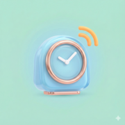
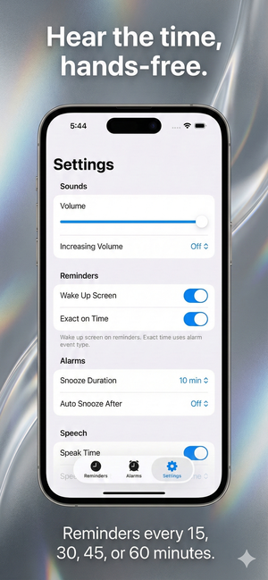
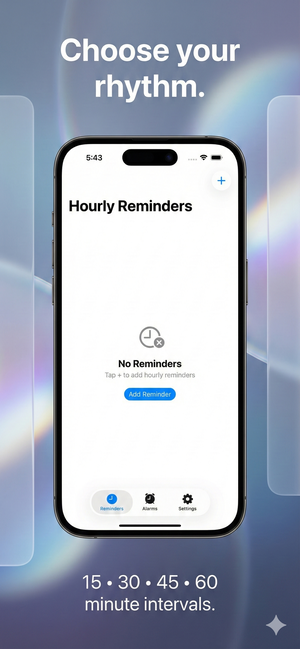
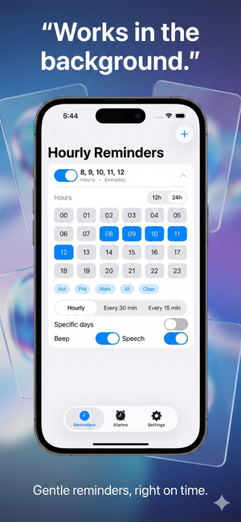
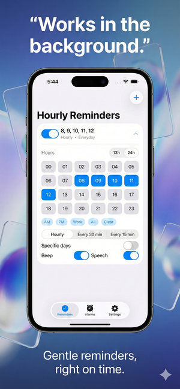
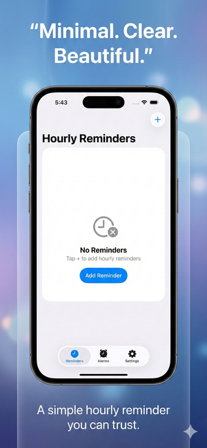

<div align="center">
  
  
  # Hourly Reminder
  
  **A simple and elegant iOS app that announces the time at regular intervals using Text-to-Speech**
  
  <p>
    
    
    
    
  </p>
  
  <p><em>Perfect for staying aware of time without constantly checking your device</em></p>
</div>

---

## 📱 Screenshots

<div align="center">
  <table>
    <tr>
      <td align="center"></td>
      <td align="center"></td>
      <td align="center"></td>
      <td align="center"></td>
      <td align="center"></td>
    </tr>
  </table>
</div>

---

## ✨ Features

<table>
  <tr>
    <td>⏰</td>
    <td><b>Customizable Reminders</b></td>
    <td>Set reminders at 15, 30, 45, or 60-minute intervals</td>
  </tr>
  <tr>
    <td>🗣️</td>
    <td><b>Text-to-Speech</b></td>
    <td>Announces the time in your preferred language</td>
  </tr>
  <tr>
    <td>🔔</td>
    <td><b>Smart Notifications</b></td>
    <td>Works even when the app is in the background with pre-recorded audio</td>
  </tr>
  <tr>
    <td>🎵</td>
    <td><b>Audio Ducking</b></td>
    <td>Music automatically lowers while the time is announced, then resumes</td>
  </tr>
  <tr>
    <td>🌙</td>
    <td><b>Theme Support</b></td>
    <td>Light and dark mode for comfortable viewing</td>
  </tr>
  <tr>
    <td>🌍</td>
    <td><b>Localization</b></td>
    <td>English and Spanish language support</td>
  </tr>
</table>

---

## ⚙️ Requirements

| Requirement | Version |
|------------|---------|
| iOS | 17.0+ |
| Device | iPhone or iPad |
| Xcode | 15.0+ |

---

## 🚀 Installation

<details>
<summary><b>Click to expand installation instructions</b></summary>

<br>

1. **Clone the repository**
   ```bash
   git clone https://github.com/jozzer182/hourly-reminder.git
   cd hourly-reminder
   ```

2. **Open in Xcode**
   ```bash
   open ios_app/Hourly\ Reminder/Hourly\ Reminder.xcodeproj
   ```

3. **Configure Signing**
   - Select your development team in `Signing & Capabilities`
   - Update the bundle identifier if needed

4. **Build and Run**
   - Select your target device
   - Press <kbd>⌘</kbd> + <kbd>R</kbd> to build and run

</details>

---

## 🔧 How It Works

<table>
  <tr>
    <th width="50%">📱 Foreground Mode</th>
    <th width="50%">🔔 Background Mode</th>
  </tr>
  <tr>
    <td>
      Uses iOS Text-to-Speech (<code>AVSpeechSynthesizer</code>) to announce the current time with your configured settings.
    </td>
    <td>
      Uses pre-recorded audio files as notification sounds since iOS doesn't allow TTS in background:
      <br><br>
      <code>:00</code> → "en punto"<br>
      <code>:15</code> → "y quince"<br>
      <code>:30</code> → "y media"<br>
      <code>:45</code> → "y cuarenta y cinco"
    </td>
  </tr>
</table>

---

## 📁 Project Structure

<details>
<summary><b>Click to expand project structure</b></summary>

```
ios_app/
└── Hourly Reminder/
    └── Hourly Reminder/
        ├── 📂 Models/           # Data models (Alarm, Reminder, ReminderSet)
        ├── 📂 Views/            # SwiftUI views
        ├── 📂 Services/         # Core services
        │   ├── TTSManager.swift           # Text-to-Speech
        │   ├── NotificationManager.swift  # Local notifications
        │   ├── StorageManager.swift       # Data persistence
        │   ├── SoundManager.swift         # Audio playback
        │   ├── ThemeManager.swift         # Theme handling
        │   └── TimezoneObserver.swift     # Timezone changes
        ├── 📂 Resources/
        │   ├── 🔊 Sounds/       # Pre-recorded audio files
        │   └── 🌍 Localization/ # en.lproj, es.lproj
        └── 📂 Assets.xcassets/  # App icons and colors
```

</details>

---

## 🔒 Privacy

<div align="center">

| Feature | Status |
|---------|--------|
| Works completely offline | ✅ |
| Collects personal data | ❌ |
| Requires internet connection | ❌ |
| Uses only local notifications | ✅ |

</div>

See **[PRIVACY_POLICY.md](PRIVACY_POLICY.md)** for full details.

---

## 🛠️ Tech Stack

<div align="center">
  
  
  
  
</div>

---

## 📄 License

This project is licensed under the **MIT License** - feel free to use, modify, and distribute.

---

<div align="center">
  <p>Made with ❤️ by <b>José Zarabanda</b></p>
  
  <a href="https://github.com/jozzer182"></a>
</div>
